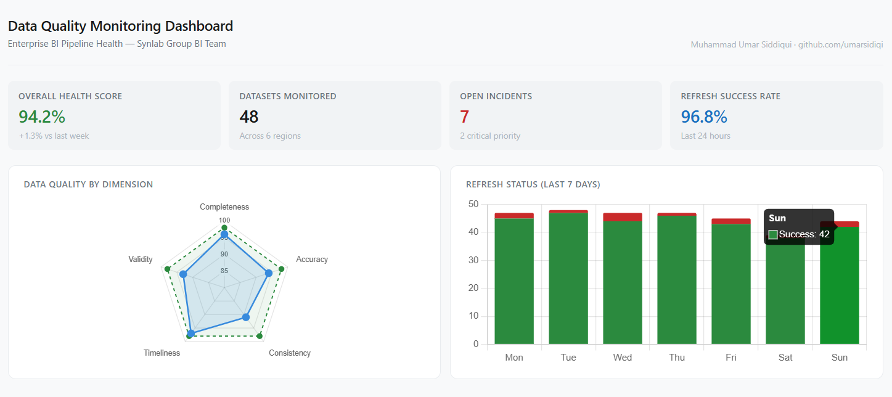

# Data Quality Monitoring Dashboard

**Live Dashboard:** [View here](https://umar-dq-dashboard.netlify.app)



## Project Overview

This project simulates an enterprise-grade **Data Quality Monitoring Dashboard** designed for a Group BI team managing data pipelines, Power BI reports, and datasets across multiple regions. The goal is to provide BI teams with a structured, real-time view of data health covering validation results, pipeline refresh status, incident tracking, and data flow documentation.

The project is built to reflect the day-to-day responsibilities of a BI operations role including monitoring data refreshes, performing data validation before report release, documenting data flows and transformations, and supporting incident tracking and SLA management.

---

## Business Problem

Large organisations managing BI pipelines across multiple regions face several recurring data quality challenges:

- No central visibility into dataset health scores and refresh status across regions
- Manual validation processes with no structured anomaly tracking
- Inconsistent documentation of data flows and transformation logic
- Difficulty managing BI support incidents and maintaining SLA compliance

This dashboard addresses all four by combining health monitoring, validation tracking, incident management, and pipeline documentation into a single interactive view.

---

## Dashboard Views

### 1. KPI Summary
Four headline metrics: overall health score, datasets monitored, open incidents, and refresh success rate — giving the team an instant operational snapshot.

### 2. Data Quality by Dimension
Radar chart comparing current scores vs target across five quality dimensions: completeness, accuracy, consistency, timeliness, and validity.

### 3. Refresh Status (Last 7 Days)
Stacked bar chart showing daily refresh success and failure counts, enabling the team to spot patterns in pipeline failures over time.

### 4. Dataset Health Overview
Filterable table covering all monitored datasets by region, showing health score with progress bar, last refresh time with status indicator, overall status, and open issue count.

### 5. Validation Results by Check Type
Horizontal stacked bar chart showing pass/fail counts for each validation check type: null checks, range validation, schema drift detection, duplicate detection, referential integrity, and row count thresholds.

### 6. Open Incidents
Incident tracker table showing active issues with priority levels, supporting SLA management and follow-up coordination.

### 7. Data Flow Documentation
Structured pipeline documentation showing source system, transformation logic, target destination, SLA, and current status for each active pipeline.

---

## Tools and Technologies

| Tool | Purpose |
|------|---------|
| HTML | Interactive dashboard structure |
| Chart.js | Radar, bar, and stacked bar visualizations |
| JavaScript | Data rendering, filtering, and interactivity |
| Python (Pandas) | Data generation and quality analysis scripts |

---

## Project Structure

```
data-quality-monitoring-dashboard/
│
├── index.html          # Interactive live dashboard
└── README.md
```

---

## How to Run Locally

```bash
git clone https://github.com/umarsidiqi/data-quality-monitoring-dashboard.git
cd data-quality-monitoring-dashboard
open index.html
```

No server required. Open directly in any browser.

---

## Author

**Muhammad Umar Siddiqui**
Master's student in International Information Systems — FAU Erlangen-Nürnberg
[LinkedIn](https://www.linkedin.com/in/umar-sidd/) 
